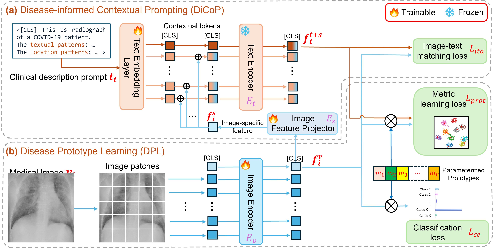
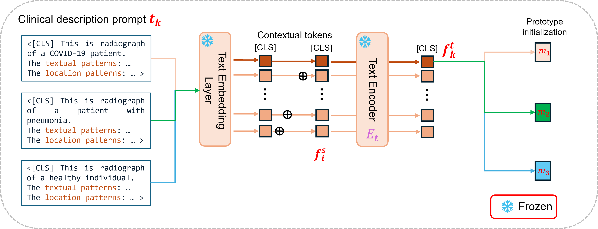
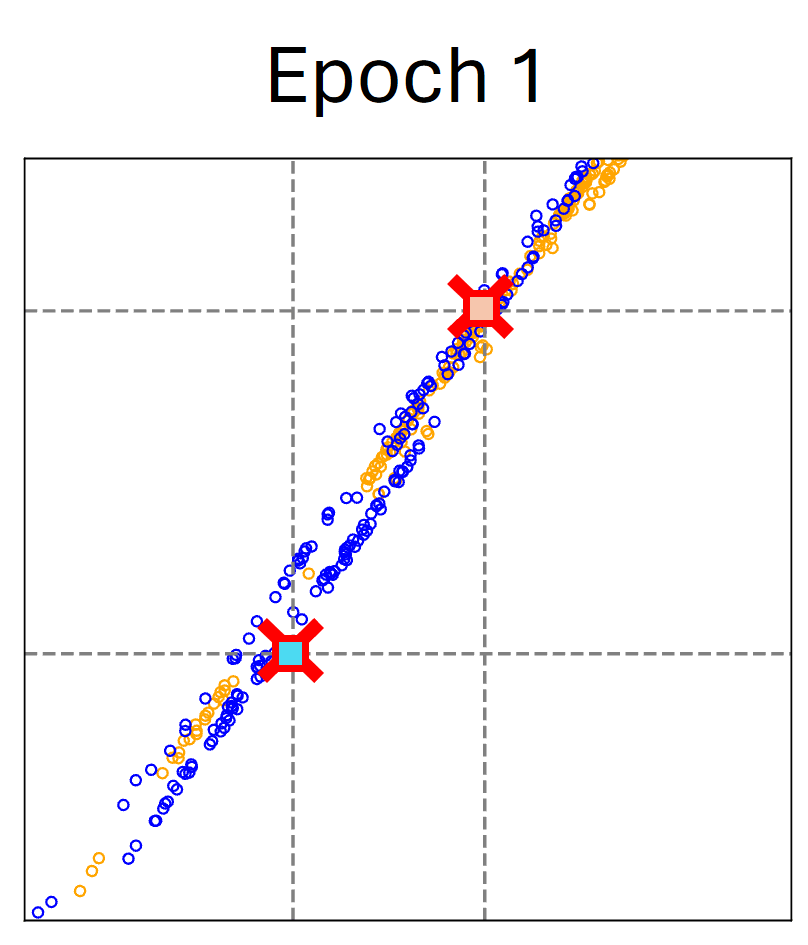
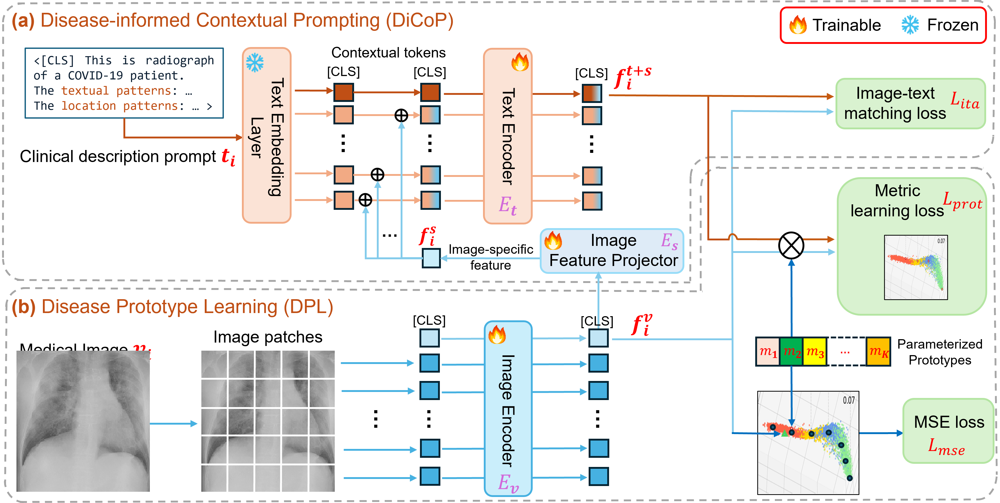

# Disease-informed VLM Adaptation

## Disease Diagnosis

### Framework overview

### Disease-informed prompts
| Findings (Condition categories) | Attributes | Prompt Candidate 1 | Prompt Candidate 2 | Prompt Candidate 3|
| :--- | :-- | :---- | :---- | :---- |
| Findings | Findings | Findings | Findings | Findings | 

### Prototype initialization

### Representation visualization

The figure above visualizes the evalution of the learnt representations epoch by epoch. 

Blue: Non-COVID pneumonia samples; Orange: COVID-19 samples.

Red cross: text-defined prompts; rectangular (blue and orange): learnt prototypes of Non-COVID pneumonia and COVID-19.

## Disease Risk Estimation

### Framework overview

