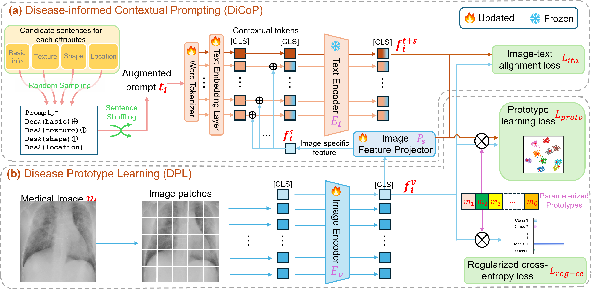

# Disease-informed Adaptation of Vision-Language Models

This repository includes extra detailed information of our __Disease-informed Adaptation__ for adapting pre-trained medical Vision-Language Models (VLMs) to *newly identified* and *under represented* diseases.

The first version of [our work](http://arxiv.org/abs/2405.15728) is early accepted by __MICCAI 2024__.

*More results and the source code will be released soon!*

## Method Overview

### Proposed Framework
<p align='center'></p>

### Disease-informed prompts

The complete set of prompt candidates for each attribute of every medical finding category is listed in the table below. Based on the disease-informed prompts (the ``Prompt candidate 1`` column) from our radiologist, we also utilized [*GPT-4*](https://arxiv.org/abs/2303.08774) to automatically generated the other two candidates (the ``Prompt candidate 2`` and ``Prompt candidate 3`` colums) for each descriptive attribute (texture, shape, and location) based on our predefined template. All these prompts were then manually revised with the help of a radiologist, ensuring that they are medically accurate. 

<table>
  <tr>
    <th style="width: 20%;"> Medical findings (Categories)</th>
    <th style="width: 25%;"> Attributes </th>
    <th style="width: 25%;"> Prompt candidate 1 </th>
    <th style="width: 25%;"> Prompt candidate 2 </th>
    <th style="width: 25%;"> Prompt candidate 3 </th>
  </tr>
  <tr>
    <td rowspan="4">COVID-19 pneumonia</td>
    <td><span style="white-space: nowrap;">Des<sub>k=1</sub>(basic)<sup id="a1"><a href="#f1">[1]</a></sup></span></td>
    <td>"A chest X-ray image of a patient with COVID-19."</td>
    <td>"A radiograph of a COVID-19 patient."</td>
    <td>"An X-ray image showing a patient diagnosed with COVID-19."</td>
  </tr>
  <tr>
    <td>Des<sub>k=1</sub>(texture)</td>
    <td>"Texture Patterns include bilateral, patchy and ground-glass opacities (GGO) in the lungs. These opacities can vary in density and distribution."</td>
    <td>"Texture patterns feature bilateral, patchy and ground-glass opacities in the lungs, which may differ in density and distribution."</td>
    <td>"Texture patterns exhibit bilateral, patchy and ground-glass opacities (GGO) in the lungs, varying in density and distribution."</td>
  </tr>
  <tr>
    <td>Des<sub>k=1</sub>(shape)</td>
    <td>"The opacities can have irregular shapes, appearing as hazy areas with fuzzy borders."</td>
    <td>"The opacities may exhibit irregular contours, manifesting as hazy regions with indistinct edges."</td>
    <td>"The opacities often feature irregular forms, presenting as blurred areas with indeterminate boundaries."</td>
  </tr>
  <tr>
    <td>Des<sub>k=1</sub>(location)</td>
    <td>"The opacities are commonly located in the peripheral regions of the lungs, particularly in the lower lobes. They may involve multiple lung segments of both chest sides."</td>
    <td>"The opacities typically appear in the peripheral areas of the lungs, especially in the lower lobes, and can affect multiple segments of both sides of the chest."</td>
    <td>"Opacities are often found in the peripheral parts of the lungs, mainly within the lower lobes, and may affect several lung segments on both sides of the chest."</td>
  </tr>
    <tr>
    <td rowspan="4">Non-COVID-19 pneumonia</td>
    <td><span style="white-space: nowrap;">Des<sub>k=2</sub>(basic)<sup id="a1"><a href="#f1">[1]</a></sup></span></td>
    <td>"A chest X-ray image of a patient with pneumonia."</td>
    <td>"A radiograph displaying the lung condition of a patient diagnosed with pneumonia."</td>
    <td>"An X-ray image of a pneumonia patient."</td>
  </tr>
  <tr>
    <td>Des<sub>k=2</sub>(texture)</td>
    <td>"Textual Patterns can include areas of increased lung density due to inflammatory infiltrates."</td>
    <td>"Textual patterns may feature regions of heightened lung density resulting from inflammatory infiltrates."</td>
    <td>"Textural patterns can display areas of elevated lung density caused by inflammatory infiltrates."</td>
  </tr>
  <tr>
    <td>Des<sub>k=2</sub>(shape)</td>
    <td>"In non-COVID pneumonia, opacities may have a lobar or segmental distribution, depending on the type of pneumonia."</td>
    <td>"Opacities can present with a lobar or segmental distribution, varying according to the specific type of pneumonia."</td>
    <td>"The distribution of opacities can be either lobar or segmental, based on the type of non-COVID pneumonia."</td>
  </tr>
  <tr>
    <td>Des<sub>k=2</sub>(location)</td>
    <td>"The location of pneumonia opacities can vary but is often seen in specific lobes or segments of the lung."</td>
    <td>"The position of pneumonia opacities varies but is usually observed in particular lobes or segments of the lung."</td>
    <td>"Pneumonia opacities can appear in various locations but commonly manifest in specific lobes or segments of the lung."</td>
  </tr>
  <tr>
    <td rowspan="4">Healthy individuals</td>
    <td><span style="white-space: nowrap;">Des<sub>k=3</sub>(basic)<sup id="a1"><a href="#f1">[1]</a></sup></span></td>
    <td>"A chest X-ray image of a normal healthy individual."</td>
    <td>"A chest X-ray showing the lungs of a normal, healthy individual."</td>
    <td>"An X-ray image of the chest from a healthy individual"</td>
  </tr>
  <tr>
    <td>Des<sub>k=3</sub>(texture)</td>
    <td>"No respiratory symptoms or underlying lung conditions, chest typically show clear lung fields with no areas of abnormal opacities."</td>
    <td>"In the absence of respiratory symptoms or pre-existing lung conditions, a chest X-ray generally reveals clear lung fields free from any abnormal opacities."</td>
    <td>"Without respiratory symptoms or pre-existing lung conditions, a chest X-ray typically shows clear lung fields without any abnormal opacities."</td>
  </tr>
  <tr>
    <td>Des<sub>k=3</sub>(shape)</td>
    <td>"No hazy areas with fuzzy borders."</td>
    <td>"There are no unclear regions with blurred boundaries."</td>
    <td>"There are no indistinct areas with blurred edges."</td>
  </tr>
  <tr>
    <td>Des<sub>k=3</sub>(location)</td>
    <td>"The whole lung fields appear homogeneous and translucent without any irregularities or opacities."</td>
    <td>"The entire lungs seem uniform and translucent, devoid of any irregularities or areas of opacity."</td>
    <td>"The whole lung fields present as homogeneous and translucent, lacking any irregularities or opacities."</td>
  </tr>
</table>

------

[1] <a id="f1">The default prompt template setting in the previous work, such as [*MaPLe*](https://arxiv.org/abs/2210.03117) and [*KgCoOp*](https://arxiv.org/abs/2303.13283).</a>


### The evolution of learned visual and linguistic representations
<p align='center'></p>

The figure above visualizes the evalution of the learnt representations epoch by epoch. 

Blue: Non-COVID pneumonia samples; Orange: COVID-19 samples.

Red cross: text-defined prompts; rectangular (blue and orange): learnt prototypes of Non-COVID pneumonia and COVID-19.

### More phrase grounding visualization
<p align='center'></p>

## Prerequisites

- Python 3.9
- PyTorch 2.3.0+cu121
- HiggingFace transformers 4.18.0
- peft 0.7.1
- A computing device with GPU (>20G)

## Getting started


### Dataset & Preparation

The two chest X-ray image datasets used in our work are publicly available.

The __COVID-x__ datasets can be found [here](https://www.kaggle.com/datasets/andyczhao/covidx-cxr2) This dataset is already preprocessed by the challenge. 

The __COVID-sev__ dataset is can be found [here](https://data.mendeley.com/datasets/36fjrg9s69/1). We follow the [this work](https://www.nature.com/articles/s41598-022-15013-z) to preprocess the datasets.


### Train model with Disease-informed Adaptation

Source code to be released ...


### Evaluation on the COVID-19 diagnosis/severity estimation/phrase grounding

Source code to be released ...


## Citation

Please cite these papers in your publications if it helps your research:

```bibtex
@article{zhang2024disease,
  title={Disease-informed Adaptation of Vision-Language Models},
  author={Zhang, Jiajin and Wang, Ge and Kalra, Mannudeep K. and Yan, Pingkun},
  booktitle={Medical Image Computing and Computer Assisted Intervention--MICCAI 2024: 27th International Conference},
  pages={},
  year={2024},
  organization={Springer}
}
```

## Acknowledgement

We would like to thank the authors we cited in our paper for sharing their codes.

